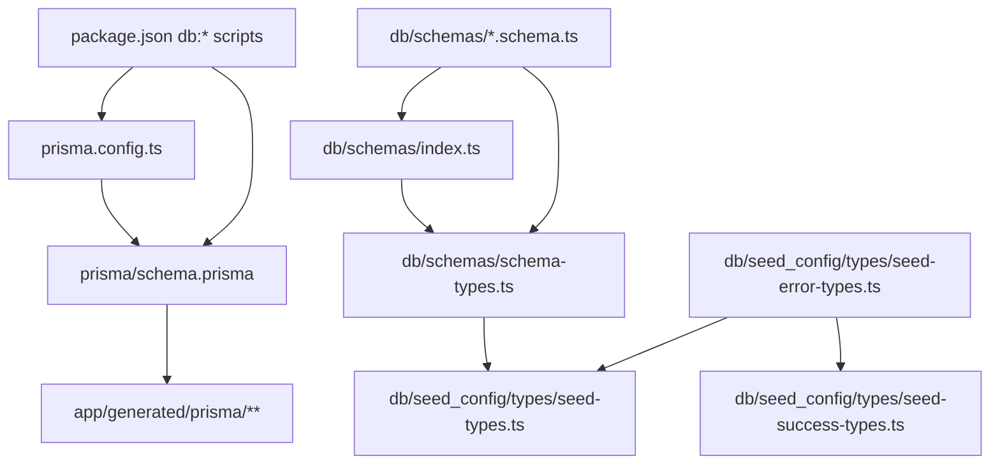

# Database File Map

This document maps the database-related files in this project: Prisma schema/config,
Zod schema files, seed files, seed type/config files, and the generated Prisma
client output. It focuses on what each file is for, what it imports and exports,
and where those exports are currently used.

## Big Picture

The current database stack has three layers:

1. `prisma/schema.prisma` is the database source of truth. It defines the
   PostgreSQL datasource, generated Prisma client output path, enums, models,
   relationships, column mappings, IDs, and date fields.
2. `db/schemas/*.schema.ts` are Zod runtime shapes written in snake_case to match
   database column names. They are useful for validation and for deriving local
   TypeScript types.
3. `db/schemas/schema-types.ts` turns the Zod schemas into TypeScript types. The
   seed type layer imports those types to describe future seed record shapes.

The seed implementation layer under `db/seed_config/seed/**` is mostly scaffolded
but empty in this snapshot. The type files under `db/seed_config/types/**` are
the active seed-related files.

## Relationship Graph

Current direct consumers found by repository search on 2026-05-06:

| Export source                                    | Direct consumers                                                                                                                                                                                  |
| ------------------------------------------------ | ------------------------------------------------------------------------------------------------------------------------------------------------------------------------------------------------- |
| `db/schemas/index.ts`                            | `db/schemas/schema-types.ts` imports the barrel with `@db/schemas/index`.                                                                                                                         |
| `db/schemas/*.schema.ts` individual enum schemas | `db/schemas/schema-types.ts` imports `abilityTypeSchema`, `unitSelectionLimitKindSchema`, and `keywordTypeSchema` directly from their files because the type file also derives enum-like aliases. |
| `db/schemas/schema-types.ts`                     | `db/seed_config/types/seed-types.ts` imports all entity types through `@schemas/schema-types`.                                                                                                    |
| `db/seed_config/types/seed-error-types.ts`       | `db/seed_config/types/seed-types.ts` imports `SeedingError` and `SeedTable`; `db/seed_config/types/seed-success-types.ts` imports `SeedTable`.                                                    |
| `db/seed_config/types/seed-success-types.ts`     | No current in-repo consumers found.                                                                                                                                                               |
| `db/seed_config/types/seed-types.ts`             | No current in-repo consumers found.                                                                                                                                                               |
| `app/generated/prisma/**`                        | No current in-repo consumers found. It is generated by Prisma from `prisma/schema.prisma`.                                                                                                        |

To refresh this section, search for database aliases and generated Prisma imports
with commands like `rg -n "@db/|@schemas/|app/generated/prisma|PrismaClient|@prisma/client"`.

## Prisma Files

| File                   | Purpose                                                                                                                                                   | Imports / exports                                                                                                                                                                                                | Consumers and relationships                                                                                             |
| ---------------------- | --------------------------------------------------------------------------------------------------------------------------------------------------------- | ---------------------------------------------------------------------------------------------------------------------------------------------------------------------------------------------------------------- | ----------------------------------------------------------------------------------------------------------------------- |
| `prisma/schema.prisma` | Defines the PostgreSQL database schema, Prisma client generator, database enums, and all relational models. This is the primary database source of truth. | No TypeScript imports/exports. Declares `generator client`, `datasource db`, six enums, and 32 models. The generator writes to `../app/generated/prisma`.                                                        | Used by Prisma CLI commands through `prisma.config.ts` and `package.json` scripts. Generates `app/generated/prisma/**`. |
| `prisma.config.ts`     | Prisma CLI configuration. Loads environment variables and tells Prisma where the schema, migrations directory, and datasource URL live.                   | Imports `dotenv/config` and `{ defineConfig, env }` from `prisma/config`. Default-exports `defineConfig({ schema, migrations, datasource })`.                                                                    | Used by Prisma CLI commands such as `prisma validate`, `prisma generate`, `prisma migrate dev`, and `prisma studio`.    |
| `package.json`         | Exposes database-related npm scripts and declares Prisma dependencies.                                                                                    | JSON file; no TypeScript imports/exports. Scripts include `db:validate`, `db:generate`, `db:migrate`, and `db:studio`; dependencies include `@prisma/client`, `@prisma/adapter-pg`, and dev dependency `prisma`. | Humans and CI can use these scripts to call Prisma CLI commands.                                                        |
| `tsconfig.json`        | Defines path aliases used by the database schema/type files.                                                                                              | JSON file; no TypeScript imports/exports. Defines `@db/*`, `@schemas/*`, and `@/*`.                                                                                                                              | Enables imports such as `@db/schemas/index` and `@schemas/schema-types`.                                                |
| `.env.example`         | Documents the expected local `DATABASE_URL` shape without real credentials.                                                                               | Environment template; no TypeScript imports/exports. Contains a sample local PostgreSQL connection string.                                                                                                       | Copied or mirrored by local `.env`, which `prisma.config.ts` loads through `dotenv/config`.                             |

There is no `prisma/migrations` directory in this snapshot, even though
`prisma.config.ts` points Prisma migrations at `prisma/migrations`.
Before running `npm run db:migrate` or `prisma migrate dev`, confirm `DATABASE_URL`
points at a local or disposable development database. The first migration in this
project should be created or baselined deliberately, not accidentally against a
shared or production database.

## Generated Prisma Client Files

These files are generated from `prisma/schema.prisma` into `app/generated/prisma`
by `npm run db:generate`. Do not hand-edit them; regenerate them after schema
changes. No current in-repo imports of these generated files were found.

| File                                                      | Purpose                                                                 | Imports / exports                                                                                                                   | Consumers and relationships                                                                          |
| --------------------------------------------------------- | ----------------------------------------------------------------------- | ----------------------------------------------------------------------------------------------------------------------------------- | ---------------------------------------------------------------------------------------------------- |
| `app/generated/prisma/client.ts`                          | Server-side Prisma client entrypoint.                                   | Exports `PrismaClient`, `Prisma`, enums, and one type alias per Prisma model. Imports generated internal runtime/namespace modules. | Generated from `prisma/schema.prisma`; intended future import point for server-side database access. |
| `app/generated/prisma/browser.ts`                         | Browser-safe generated Prisma namespace/types entrypoint.               | Exports `Prisma`, `$Enums`, enums, and model type aliases without exposing the server client constructor.                           | Generated from `prisma/schema.prisma`; no current in-repo consumers.                                 |
| `app/generated/prisma/enums.ts`                           | Generated enum constants and TypeScript enum-like types.                | Exports `RulesSourceType`, `SourceRelationship`, `AccessType`, `KeywordType`, `AbilityType`, and `UnitSelectionLimitKind`.          | Re-exported by `client.ts` and `browser.ts`; generated from Prisma enums.                            |
| `app/generated/prisma/commonInputTypes.ts`                | Shared Prisma query/filter/order input types.                           | Exports generated filter, aggregate, nested filter, and sort input types.                                                           | Re-exported by `models.ts` and used by generated model type modules.                                 |
| `app/generated/prisma/models.ts`                          | Barrel for generated model-specific type modules.                       | Type-re-exports every file in `app/generated/prisma/models/` plus `commonInputTypes.ts`.                                            | Imported by generated internal namespace files; no current hand-written consumers.                   |
| `app/generated/prisma/internal/class.ts`                  | Generated Prisma client class wiring.                                   | Generated internal exports used by `client.ts`.                                                                                     | Internal generated dependency of `client.ts`; do not import directly from application code.          |
| `app/generated/prisma/internal/prismaNamespace.ts`        | Generated server Prisma namespace.                                      | Exports generated Prisma namespace types/constants for server client use.                                                           | Imported by `client.ts` and other generated internals.                                               |
| `app/generated/prisma/internal/prismaNamespaceBrowser.ts` | Generated browser-safe Prisma namespace.                                | Exports browser-safe namespace values, model names, scalar field enums, and type re-exports.                                        | Imported by `browser.ts` and generated internals.                                                    |
| `app/generated/prisma/models/Ability.ts`                  | Generated TypeScript types for Prisma model `Ability`.                  | Exports model payload, field reference, CRUD args, and related input/output types for `Ability`.                                    | Re-exported by `app/generated/prisma/models.ts`; generated from `model Ability`.                     |
| `app/generated/prisma/models/Detachment.ts`               | Generated TypeScript types for Prisma model `Detachment`.               | Exports model payload, field reference, CRUD args, and related input/output types for `Detachment`.                                 | Re-exported by `app/generated/prisma/models.ts`; generated from `model Detachment`.                  |
| `app/generated/prisma/models/DetachmentUnitKeyword.ts`    | Generated TypeScript types for Prisma model `DetachmentUnitKeyword`.    | Exports model payload, field reference, CRUD args, and related input/output types for `DetachmentUnitKeyword`.                      | Re-exported by `app/generated/prisma/models.ts`; generated from `model DetachmentUnitKeyword`.       |
| `app/generated/prisma/models/GameEdition.ts`              | Generated TypeScript types for Prisma model `GameEdition`.              | Exports model payload, field reference, CRUD args, and related input/output types for `GameEdition`.                                | Re-exported by `app/generated/prisma/models.ts`; generated from `model GameEdition`.                 |
| `app/generated/prisma/models/GameSize.ts`                 | Generated TypeScript types for Prisma model `GameSize`.                 | Exports model payload, field reference, CRUD args, and related input/output types for `GameSize`.                                   | Re-exported by `app/generated/prisma/models.ts`; generated from `model GameSize`.                    |
| `app/generated/prisma/models/Keyword.ts`                  | Generated TypeScript types for Prisma model `Keyword`.                  | Exports model payload, field reference, CRUD args, and related input/output types for `Keyword`.                                    | Re-exported by `app/generated/prisma/models.ts`; generated from `model Keyword`.                     |
| `app/generated/prisma/models/Kit.ts`                      | Generated TypeScript types for Prisma model `Kit`.                      | Exports model payload, field reference, CRUD args, and related input/output types for `Kit`.                                        | Re-exported by `app/generated/prisma/models.ts`; generated from `model Kit`.                         |
| `app/generated/prisma/models/KitModel.ts`                 | Generated TypeScript types for Prisma model `KitModel`.                 | Exports model payload, field reference, CRUD args, and related input/output types for `KitModel`.                                   | Re-exported by `app/generated/prisma/models.ts`; generated from `model KitModel`.                    |
| `app/generated/prisma/models/KitPrice.ts`                 | Generated TypeScript types for Prisma model `KitPrice`.                 | Exports model payload, field reference, CRUD args, and related input/output types for `KitPrice`.                                   | Re-exported by `app/generated/prisma/models.ts`; generated from `model KitPrice`.                    |
| `app/generated/prisma/models/KitType.ts`                  | Generated TypeScript types for Prisma model `KitType`.                  | Exports model payload, field reference, CRUD args, and related input/output types for `KitType`.                                    | Re-exported by `app/generated/prisma/models.ts`; generated from `model KitType`.                     |
| `app/generated/prisma/models/LeaderEligibility.ts`        | Generated TypeScript types for Prisma model `LeaderEligibility`.        | Exports model payload, field reference, CRUD args, and related input/output types for `LeaderEligibility`.                          | Re-exported by `app/generated/prisma/models.ts`; generated from `model LeaderEligibility`.           |
| `app/generated/prisma/models/LeaderEligibilityKeyword.ts` | Generated TypeScript types for Prisma model `LeaderEligibilityKeyword`. | Exports model payload, field reference, CRUD args, and related input/output types for `LeaderEligibilityKeyword`.                   | Re-exported by `app/generated/prisma/models.ts`; generated from `model LeaderEligibilityKeyword`.    |
| `app/generated/prisma/models/Model.ts`                    | Generated TypeScript types for Prisma model `Model`.                    | Exports model payload, field reference, CRUD args, and related input/output types for `Model`.                                      | Re-exported by `app/generated/prisma/models.ts`; generated from `model Model`.                       |
| `app/generated/prisma/models/Player.ts`                   | Generated TypeScript types for Prisma model `Player`.                   | Exports model payload, field reference, CRUD args, and related input/output types for `Player`.                                     | Re-exported by `app/generated/prisma/models.ts`; generated from `model Player`.                      |
| `app/generated/prisma/models/PlayerArmyList.ts`           | Generated TypeScript types for Prisma model `PlayerArmyList`.           | Exports model payload, field reference, CRUD args, and related input/output types for `PlayerArmyList`.                             | Re-exported by `app/generated/prisma/models.ts`; generated from `model PlayerArmyList`.              |
| `app/generated/prisma/models/PlayerArmyListUnit.ts`       | Generated TypeScript types for Prisma model `PlayerArmyListUnit`.       | Exports model payload, field reference, CRUD args, and related input/output types for `PlayerArmyListUnit`.                         | Re-exported by `app/generated/prisma/models.ts`; generated from `model PlayerArmyListUnit`.          |
| `app/generated/prisma/models/PlayerCollection.ts`         | Generated TypeScript types for Prisma model `PlayerCollection`.         | Exports model payload, field reference, CRUD args, and related input/output types for `PlayerCollection`.                           | Re-exported by `app/generated/prisma/models.ts`; generated from `model PlayerCollection`.            |
| `app/generated/prisma/models/PlayerCollectionModel.ts`    | Generated TypeScript types for Prisma model `PlayerCollectionModel`.    | Exports model payload, field reference, CRUD args, and related input/output types for `PlayerCollectionModel`.                      | Re-exported by `app/generated/prisma/models.ts`; generated from `model PlayerCollectionModel`.       |
| `app/generated/prisma/models/RulesFaction.ts`             | Generated TypeScript types for Prisma model `RulesFaction`.             | Exports model payload, field reference, CRUD args, and related input/output types for `RulesFaction`.                               | Re-exported by `app/generated/prisma/models.ts`; generated from `model RulesFaction`.                |
| `app/generated/prisma/models/RulesFactionDetachment.ts`   | Generated TypeScript types for Prisma model `RulesFactionDetachment`.   | Exports model payload, field reference, CRUD args, and related input/output types for `RulesFactionDetachment`.                     | Re-exported by `app/generated/prisma/models.ts`; generated from `model RulesFactionDetachment`.      |
| `app/generated/prisma/models/RulesFactionSource.ts`       | Generated TypeScript types for Prisma model `RulesFactionSource`.       | Exports model payload, field reference, CRUD args, and related input/output types for `RulesFactionSource`.                         | Re-exported by `app/generated/prisma/models.ts`; generated from `model RulesFactionSource`.          |
| `app/generated/prisma/models/RulesFactionUnit.ts`         | Generated TypeScript types for Prisma model `RulesFactionUnit`.         | Exports model payload, field reference, CRUD args, and related input/output types for `RulesFactionUnit`.                           | Re-exported by `app/generated/prisma/models.ts`; generated from `model RulesFactionUnit`.            |
| `app/generated/prisma/models/RulesSource.ts`              | Generated TypeScript types for Prisma model `RulesSource`.              | Exports model payload, field reference, CRUD args, and related input/output types for `RulesSource`.                                | Re-exported by `app/generated/prisma/models.ts`; generated from `model RulesSource`.                 |
| `app/generated/prisma/models/SuperFaction.ts`             | Generated TypeScript types for Prisma model `SuperFaction`.             | Exports model payload, field reference, CRUD args, and related input/output types for `SuperFaction`.                               | Re-exported by `app/generated/prisma/models.ts`; generated from `model SuperFaction`.                |
| `app/generated/prisma/models/Unit.ts`                     | Generated TypeScript types for Prisma model `Unit`.                     | Exports model payload, field reference, CRUD args, and related input/output types for `Unit`.                                       | Re-exported by `app/generated/prisma/models.ts`; generated from `model Unit`.                        |
| `app/generated/prisma/models/UnitAbility.ts`              | Generated TypeScript types for Prisma model `UnitAbility`.              | Exports model payload, field reference, CRUD args, and related input/output types for `UnitAbility`.                                | Re-exported by `app/generated/prisma/models.ts`; generated from `model UnitAbility`.                 |
| `app/generated/prisma/models/UnitKeyword.ts`              | Generated TypeScript types for Prisma model `UnitKeyword`.              | Exports model payload, field reference, CRUD args, and related input/output types for `UnitKeyword`.                                | Re-exported by `app/generated/prisma/models.ts`; generated from `model UnitKeyword`.                 |
| `app/generated/prisma/models/UnitModel.ts`                | Generated TypeScript types for Prisma model `UnitModel`.                | Exports model payload, field reference, CRUD args, and related input/output types for `UnitModel`.                                  | Re-exported by `app/generated/prisma/models.ts`; generated from `model UnitModel`.                   |
| `app/generated/prisma/models/UnitPointCost.ts`            | Generated TypeScript types for Prisma model `UnitPointCost`.            | Exports model payload, field reference, CRUD args, and related input/output types for `UnitPointCost`.                              | Re-exported by `app/generated/prisma/models.ts`; generated from `model UnitPointCost`.               |
| `app/generated/prisma/models/UnitProfile.ts`              | Generated TypeScript types for Prisma model `UnitProfile`.              | Exports model payload, field reference, CRUD args, and related input/output types for `UnitProfile`.                                | Re-exported by `app/generated/prisma/models.ts`; generated from `model UnitProfile`.                 |
| `app/generated/prisma/models/UnitProfileStat.ts`          | Generated TypeScript types for Prisma model `UnitProfileStat`.          | Exports model payload, field reference, CRUD args, and related input/output types for `UnitProfileStat`.                            | Re-exported by `app/generated/prisma/models.ts`; generated from `model UnitProfileStat`.             |
| `app/generated/prisma/models/UnitSelectionLimit.ts`       | Generated TypeScript types for Prisma model `UnitSelectionLimit`.       | Exports model payload, field reference, CRUD args, and related input/output types for `UnitSelectionLimit`.                         | Re-exported by `app/generated/prisma/models.ts`; generated from `model UnitSelectionLimit`.          |

## Prisma Schema Contents

`prisma/schema.prisma` defines these enums:

| Enum                     | Role                                                                                                                                      |
| ------------------------ | ----------------------------------------------------------------------------------------------------------------------------------------- |
| `RulesSourceType`        | Classifies publication/source types such as codex, online, expansion, campaign book, Munitorum Field Manual, codex supplement, and other. |
| `SourceRelationship`     | Describes how a source relates to a faction: primary, supplement, shared base, or exclusive.                                              |
| `AccessType`             | Shared/inherited/exclusive access for units or detachments.                                                                               |
| `KeywordType`            | Classifies keywords as unit, faction, model, or rules keywords.                                                                           |
| `AbilityType`            | Classifies abilities as core, faction, datasheet, wargear, or other.                                                                      |
| `UnitSelectionLimitKind` | Captures repeated-unit limit types: epic, battleline, or other.                                                                           |

`prisma/schema.prisma` defines these models:

| Model                      | Purpose                                                                                     |
| -------------------------- | ------------------------------------------------------------------------------------------- |
| `GameEdition`              | Game edition identity, such as 10th edition, and parent for edition-scoped rules.           |
| `GameSize`                 | Points bands for list sizes within an edition.                                              |
| `SuperFaction`             | Top-level faction bucket.                                                                   |
| `RulesFaction`             | Rules-facing faction identity used for legality and source relationships.                   |
| `RulesSource`              | Publication or release channel containing rules, points, units, detachments, or abilities.  |
| `RulesFactionSource`       | Join table linking factions to sources and describing the relationship.                     |
| `Detachment`               | Selectable detachment rule package from a rules source.                                     |
| `RulesFactionDetachment`   | Join table describing which factions can use which detachments.                             |
| `Unit`                     | Datasheet-level unit identity.                                                              |
| `RulesFactionUnit`         | Join table describing which factions can use which units.                                   |
| `UnitProfile`              | Edition/source-specific profile for a unit or a specific model inside a unit.               |
| `UnitProfileStat`          | Flexible key/value stat rows attached to a unit profile.                                    |
| `UnitPointCost`            | Edition/source-specific points cost for a unit and model-count range.                       |
| `Keyword`                  | Unit, faction, model, or rules keyword.                                                     |
| `UnitKeyword`              | Keyword assignment to a unit, optionally scoped to a specific model.                        |
| `DetachmentUnitKeyword`    | Keyword override granted by a detachment.                                                   |
| `UnitSelectionLimit`       | Rule that limits repeated units by edition, game size, and keyword.                         |
| `Model`                    | Physical model identity that can appear in units, kits, and collections.                    |
| `UnitModel`                | Composition rule connecting units to model identities and allowed counts.                   |
| `KitType`                  | Product/kit category metadata.                                                              |
| `Kit`                      | Games Workshop product/box information.                                                     |
| `KitModel`                 | Join table connecting kits to the model identities inside them.                             |
| `KitPrice`                 | Observed kit price with source/currency/date metadata.                                      |
| `Ability`                  | Reusable ability identity.                                                                  |
| `UnitAbility`              | Edition/source-specific ability text attached to a unit.                                    |
| `LeaderEligibility`        | Rule describing which unit a leader can join, either by exact unit or keyword requirements. |
| `LeaderEligibilityKeyword` | Keyword requirement attached to a leader eligibility rule.                                  |
| `Player`                   | Registered user/player identity.                                                            |
| `PlayerArmyList`           | Saved army list header, faction, detachment, points, and snapshot dates.                    |
| `PlayerArmyListUnit`       | Unit selected into an army list, including copied points for auditability.                  |
| `PlayerCollection`         | Player-owned model collection header.                                                       |
| `PlayerCollectionModel`    | Model identity and count inside a player collection.                                        |

## Zod Schema Files

Every file in `db/schemas/*.schema.ts` imports `z` from `zod`, exports one or
more Zod schemas, and is re-exported by `db/schemas/index.ts` unless noted. The
schemas use snake_case field names, which match database column names rather than
Prisma's generated camelCase model property names.

| File                                        | Purpose                                                                                             | Exports                                                                            | Consumers                                                                                                            |
| ------------------------------------------- | --------------------------------------------------------------------------------------------------- | ---------------------------------------------------------------------------------- | -------------------------------------------------------------------------------------------------------------------- |
| `db/schemas/abilities.schema.ts`            | Validation shapes for ability records and unit-specific ability text.                               | `abilityTypeSchema`, `abilitySchema`, `unitAbilitySchema`.                         | Re-exported by `db/schemas/index.ts`; `abilityTypeSchema` is also directly imported by `schema-types.ts`.            |
| `db/schemas/detachments.schema.ts`          | Validation shapes for detachments, faction-detachment access, and detachment-granted unit keywords. | `detachmentSchema`, `rulesFactionDetachmentSchema`, `detachmentUnitKeywordSchema`. | Re-exported by `db/schemas/index.ts`; imported through the barrel by `schema-types.ts`.                              |
| `db/schemas/game.schema.ts`                 | Validation shapes for game editions and game sizes.                                                 | `gameEditionSchema`, `gameSizeSchema`.                                             | Re-exported by `db/schemas/index.ts`; imported through the barrel by `schema-types.ts`.                              |
| `db/schemas/keywords.schema.ts`             | Validation shapes for keyword records and unit-keyword assignments.                                 | `keywordTypeSchema`, `keywordSchema`, `unitKeywordSchema`.                         | Re-exported by `db/schemas/index.ts`; `keywordTypeSchema` is also directly imported by `schema-types.ts`.            |
| `db/schemas/kits.schema.ts`                 | Validation shapes for kit types, kits, kit-model joins, and kit prices.                             | `kitTypeSchema`, `kitSchema`, `kitModelSchema`, `kitPriceSchema`.                  | Re-exported by `db/schemas/index.ts`; imported through the barrel by `schema-types.ts`.                              |
| `db/schemas/leaderEligibility.schema.ts`    | Validation shapes for leader-to-target-unit rules and keyword requirements.                         | `leaderEligibilitySchema`, `leaderEligibilityKeywordSchema`.                       | Re-exported by `db/schemas/index.ts`; imported through the barrel by `schema-types.ts`.                              |
| `db/schemas/models.schema.ts`               | Validation shapes for physical model identities and unit composition rows.                          | `modelSchema`, `unitModelSchema`.                                                  | Re-exported by `db/schemas/index.ts`; imported through the barrel by `schema-types.ts`.                              |
| `db/schemas/playerArmyList.schema.ts`       | Validation shapes for saved player lists and units selected into those lists.                       | `playerArmyListSchema`, `playerArmyListUnitSchema`.                                | Re-exported by `db/schemas/index.ts`; imported through the barrel by `schema-types.ts`.                              |
| `db/schemas/playerCollection.schema.ts`     | Validation shapes for player model collections and owned model rows.                                | `playerCollectionSchema`, `playerCollectionModelSchema`.                           | Re-exported by `db/schemas/index.ts`; imported through the barrel by `schema-types.ts`.                              |
| `db/schemas/players.schema.ts`              | Validation shape for player identity rows.                                                          | `playerSchema`.                                                                    | Re-exported by `db/schemas/index.ts`; imported through the barrel by `schema-types.ts`.                              |
| `db/schemas/rulesFactionUnit.schema.ts`     | Validation shape for faction-to-unit access rows.                                                   | `rulesFactionUnitSchema`.                                                          | Re-exported by `db/schemas/index.ts`; imported through the barrel by `schema-types.ts`.                              |
| `db/schemas/rulesFactions.schema.ts`        | Validation shape for rules faction rows.                                                            | `rulesFactionSchema`.                                                              | Re-exported by `db/schemas/index.ts`; imported through the barrel by `schema-types.ts`.                              |
| `db/schemas/rulesFactionsSources.schema.ts` | Validation shape for faction-to-source relationship rows.                                           | `rulesFactionsSourcesSchema`.                                                      | Re-exported by `db/schemas/index.ts`; imported through the barrel by `schema-types.ts`.                              |
| `db/schemas/rulesSources.schema.ts`         | Validation shape for rules source/publication rows.                                                 | `rulesSourceSchema`.                                                               | Re-exported by `db/schemas/index.ts`; imported through the barrel by `schema-types.ts`.                              |
| `db/schemas/superfactions.schema.ts`        | Validation shape for top-level super-faction rows.                                                  | `superFactionSchema`.                                                              | Re-exported by `db/schemas/index.ts`; imported through the barrel by `schema-types.ts`.                              |
| `db/schemas/unitPointCost.schema.ts`        | Validation shape for points costs by unit, model-count range, edition, source, and effective dates. | `unitPointCostSchema`.                                                             | Re-exported by `db/schemas/index.ts`; imported through the barrel by `schema-types.ts`.                              |
| `db/schemas/unitProfiles.schema.ts`         | Validation shapes for unit profiles and flexible stat rows.                                         | `unitProfileSchema`, `unitProfileStatSchema`.                                      | Re-exported by `db/schemas/index.ts`; imported through the barrel by `schema-types.ts`.                              |
| `db/schemas/units.schema.ts`                | Validation shape for unit identity rows.                                                            | `unitSchema`.                                                                      | Re-exported by `db/schemas/index.ts`; imported through the barrel by `schema-types.ts`.                              |
| `db/schemas/unitSelectionLimits.schema.ts`  | Validation shapes for repeated-unit limit kinds and limit rows.                                     | `unitSelectionLimitKindSchema`, `unitSelectionLimitSchema`.                        | Re-exported by `db/schemas/index.ts`; `unitSelectionLimitKindSchema` is also directly imported by `schema-types.ts`. |

## Zod Barrel and Inferred Types

| File                         | Purpose                                                                                                                                                                         | Imports / exports                                                                                                                                                                                                                                                                                                                                                                                   | Consumers                                                                                                           |
| ---------------------------- | ------------------------------------------------------------------------------------------------------------------------------------------------------------------------------- | --------------------------------------------------------------------------------------------------------------------------------------------------------------------------------------------------------------------------------------------------------------------------------------------------------------------------------------------------------------------------------------------------- | ------------------------------------------------------------------------------------------------------------------- |
| `db/schemas/index.ts`        | Barrel file that gathers the individual Zod schema modules behind one import path. It imports by re-exporting each schema file and exposes their exported schemas to consumers. | Re-exports everything from the 19 `*.schema.ts` files listed above. It does not import or export `schema-types.ts`.                                                                                                                                                                                                                                                                                 | `db/schemas/schema-types.ts` imports entity schemas from `@db/schemas/index`. No other direct consumers were found. |
| `db/schemas/schema-types.ts` | Derives TypeScript types from Zod schemas with `z.infer`. This keeps seed/config types aligned with runtime validators.                                                         | Imports most schemas from `@db/schemas/index`; imports `abilityTypeSchema`, `unitSelectionLimitKindSchema`, and `keywordTypeSchema` directly; imports `z` from `zod`. Exports entity types, including `GameEdition`, `Unit`, `Kit`, `PlayerArmyList`, and others, plus enum-like aliases such as `AbilityType`, `RulesSourceType`, `SourceRelationship`, `KeywordType`, and `DetachmentAccessType`. | `db/seed_config/types/seed-types.ts` imports all entity types from `@schemas/schema-types`.                         |

## Seed and Seed Config Files

| File                                         | Purpose                                                                                                                                                                                                                        | Imports / exports                                                                                                                                                                                                                                                                                                                                                                                     | Consumers                                                                                                            |
| -------------------------------------------- | ------------------------------------------------------------------------------------------------------------------------------------------------------------------------------------------------------------------------------ | ----------------------------------------------------------------------------------------------------------------------------------------------------------------------------------------------------------------------------------------------------------------------------------------------------------------------------------------------------------------------------------------------------- | -------------------------------------------------------------------------------------------------------------------- |
| `db/seed.ts`                                 | Intended Prisma seed entrypoint. Currently empty.                                                                                                                                                                              | None.                                                                                                                                                                                                                                                                                                                                                                                                 | No current consumers found. There is also no `prisma.seed` or package script pointing at it in `package.json`.       |
| `db/seed_config/index.ts`                    | Intended seed-config barrel. Currently empty.                                                                                                                                                                                  | None.                                                                                                                                                                                                                                                                                                                                                                                                 | No current consumers found.                                                                                          |
| `db/seed_config/types/seed-error-types.ts`   | Active seed error/context type definitions.                                                                                                                                                                                    | Exports `SeedTable`, `SeedOperation`, `SeedingErrorContext`, and `SeedingError`.                                                                                                                                                                                                                                                                                                                      | `seed-types.ts` imports `SeedingError` and `SeedTable`; `seed-success-types.ts` imports `SeedTable`.                 |
| `db/seed_config/types/seed-success-types.ts` | Active seed success/result type helpers.                                                                                                                                                                                       | Imports `SeedTable`. Exports `SeedDateConfig`, generic `SeededRecord`, and alias `Seeded`.                                                                                                                                                                                                                                                                                                            | No current in-repo consumers found.                                                                                  |
| `db/seed_config/types/seed-types.ts`         | Active seed configuration type map. It adapts the Zod-inferred entity types into seed config types by intersecting `BaseEntityConfig`, adding `seedSequence` and date config metadata, and omitting database timestamp fields. | Imports `z`, `DateOptions`, `SeedingError`, `SeedTable`, `LogInfo`, and entity types from `@schemas/schema-types`. Exports `BaseEntityConfig`, one `*Config` type per database entity, `SeedMode`, `SeedRunOptions`, `SeedPhaseName`, `SeedPhaseStatus`, and `SeedTableConfigMap`. It imports but does not re-export `SeedTable`, and it declares a private `SeedRecord` helper that is not exported. | No current in-repo consumers found. This file is the likely contract for future seed phases and generated seed data. |

These seed scaffold files currently exist but are empty. Because they contain no
code, every row has `None` for imports/exports and no current consumers.

| File                                                     | Purpose from path/name                                                                                         | Imports / exports | Consumers and relationships                                                                                                               |
| -------------------------------------------------------- | -------------------------------------------------------------------------------------------------------------- | ----------------- | ----------------------------------------------------------------------------------------------------------------------------------------- |
| `db/seed_config/seed/dates.ts`                           | Planned date helper module for seed records.                                                                   | None.             | No current consumers found.                                                                                                               |
| `db/seed_config/seed/ids.ts`                             | Planned deterministic ID helper module for seed records.                                                       | None.             | No current consumers found.                                                                                                               |
| `db/seed_config/seed/utils.ts`                           | Planned shared seed utility module.                                                                            | None.             | No current consumers found.                                                                                                               |
| `db/seed_config/seed/validators.ts`                      | Planned validation helper module for seed records.                                                             | None.             | No current consumers found.                                                                                                               |
| `db/seed_config/seed/state-machine.ts`                   | Planned status/state transition helper for seed runs.                                                          | None.             | No current consumers found.                                                                                                               |
| `db/seed_config/seed/registry.ts`                        | Planned registry for seed phases.                                                                              | None.             | No current consumers found.                                                                                                               |
| `db/seed_config/seed/runner.ts`                          | Planned seed runner orchestration module.                                                                      | None.             | No current consumers found.                                                                                                               |
| `db/seed_config/seed/import/import-report.ts`            | Planned report module for JSON import results.                                                                 | None.             | No current consumers found.                                                                                                               |
| `db/seed_config/seed/import/json-loaders.ts`             | Planned source JSON loading module.                                                                            | None.             | No current consumers found.                                                                                                               |
| `db/seed_config/seed/import/json-normalizers.ts`         | Planned source JSON normalization module.                                                                      | None.             | No current consumers found.                                                                                                               |
| `db/seed_config/seed/import/json-to-seed-modules.ts`     | Planned conversion module from normalized JSON to seed modules.                                                | None.             | No current consumers found.                                                                                                               |
| `db/seed_config/seed/phases/reference-data.ts`           | Planned seed phase for baseline reference data.                                                                | None.             | No current consumers found. File name roughly corresponds to `SeedPhaseName` value `reference_data`.                                      |
| `db/seed_config/seed/phases/factions.ts`                 | Planned seed phase for faction data.                                                                           | None.             | No current consumers found. Corresponds to `SeedPhaseName` value `factions`.                                                              |
| `db/seed_config/seed/phases/units.ts`                    | Planned seed phase for unit data.                                                                              | None.             | No current consumers found. Corresponds to `SeedPhaseName` value `units`.                                                                 |
| `db/seed_config/seed/phases/models.ts`                   | Planned seed phase for model data.                                                                             | None.             | No current consumers found. Corresponds to `SeedPhaseName` value `models`.                                                                |
| `db/seed_config/seed/phases/kits.ts`                     | Planned seed phase for kit data.                                                                               | None.             | No current consumers found. Corresponds to `SeedPhaseName` value `kits`.                                                                  |
| `db/seed_config/seed/phases/prices.ts`                   | Planned seed phase for price data.                                                                             | None.             | No current consumers found. There is no exact `SeedPhaseName` value named `prices`; it may later map into kit or unit point cost seeding. |
| `db/seed_config/seed/phases/demo-player-data.ts`         | Planned seed phase for demo player/list/collection data.                                                       | None.             | No current consumers found. Related to `SeedPhaseName` value `player_data`, but the filename does not match exactly.                      |
| `db/seed_config/seed/generated/game-editions.seed.ts`    | Reserved generated/static seed module for game edition rows.                                                   | None.             | No current consumers found.                                                                                                               |
| `db/seed_config/seed/generated/game-sizes.seed.ts`       | Reserved generated/static seed module for game size rows.                                                      | None.             | No current consumers found.                                                                                                               |
| `db/seed_config/seed/generated/superfactions.seed.ts`    | Reserved generated/static seed module for super-faction rows.                                                  | None.             | No current consumers found.                                                                                                               |
| `db/seed_config/seed/generated/rules-factions.seed.ts`   | Reserved generated/static seed module for rules faction rows.                                                  | None.             | No current consumers found.                                                                                                               |
| `db/seed_config/seed/generated/rules-sources.seed.ts`    | Reserved generated/static seed module for rules source rows.                                                   | None.             | No current consumers found.                                                                                                               |
| `db/seed_config/seed/generated/units.seed.ts`            | Reserved generated/static seed module for unit rows.                                                           | None.             | No current consumers found.                                                                                                               |
| `db/seed_config/seed/generated/unit-point-costs.seed.ts` | Reserved generated/static seed module for unit point cost rows.                                                | None.             | No current consumers found.                                                                                                               |
| `db/seed_config/seed/generated/kits.seed.ts`             | Reserved generated/static seed module for kit rows.                                                            | None.             | No current consumers found.                                                                                                               |
| `db/seed_config/seed/generated/kit-prices.seed.ts`       | Reserved generated/static seed module for kit price rows.                                                      | None.             | No current consumers found.                                                                                                               |
| `db/seed_config/seed/generated/mappings.seed.ts`         | Reserved generated/static seed module for mapping data between external source records and local seed records. | None.             | No current consumers found.                                                                                                               |

The current `SeedPhaseName` type also includes `detachments`, `unit_rules`,
`leader_rules`, and `player_data`. There are no empty phase files with those
exact names in this snapshot, and the existing `prices.ts` file has no exact
matching `SeedPhaseName` value.

## Static and Generated Data Roles

The repo contains three related but distinct concepts:

| Data kind                             | Location                                                  | Role                                                                                                        |
| ------------------------------------- | --------------------------------------------------------- | ----------------------------------------------------------------------------------------------------------- |
| Database schema source                | `prisma/schema.prisma`                                    | Authoritative relational model for PostgreSQL and Prisma.                                                   |
| Runtime validation/static type source | `db/schemas/*.schema.ts` and `db/schemas/schema-types.ts` | Handwritten Zod validators and inferred TypeScript types that use database-style field names.               |
| Generated client                      | `app/generated/prisma/**`                                 | Prisma-generated code from `prisma/schema.prisma`. Regenerate with `npm run db:generate`; do not hand-edit. |
| Generated seed placeholders           | `db/seed_config/seed/generated/*.seed.ts`                 | Reserved locations for generated seed data. They are empty in this snapshot.                                |

## Import Path Notes

`tsconfig.json` defines aliases that are important for these files:

| Alias        | Points to        | Current database-related use                                              |
| ------------ | ---------------- | ------------------------------------------------------------------------- |
| `@db/*`      | `./db/*`         | `schema-types.ts` imports the schema barrel as `@db/schemas/index`.       |
| `@schemas/*` | `./db/schemas/*` | `seed-types.ts` imports inferred entity types as `@schemas/schema-types`. |
| `@/*`        | project root     | `seed-types.ts` imports utility/logging types with `@/utils/...`.         |

## Maintenance Notes

- Keep `prisma/schema.prisma` and `db/schemas/*.schema.ts` synchronized manually;
  there is no current generator that derives the Zod schemas from Prisma.
- If generated Prisma client files change, prefer `npm run db:generate` over
  manual edits.
- If the seed pipeline is implemented later, `db/seed_config/index.ts` should
  likely become the public barrel for seed config exports, and `db/seed.ts`
  should become the executable seed entrypoint.
- Several imports in `seed-types.ts` describe planned behavior rather than
  current behavior. For example, `SeedingError`, `SeedTable`, `LogInfo`, and `z`
  are imported but not yet used by exported runtime code in the current file.
