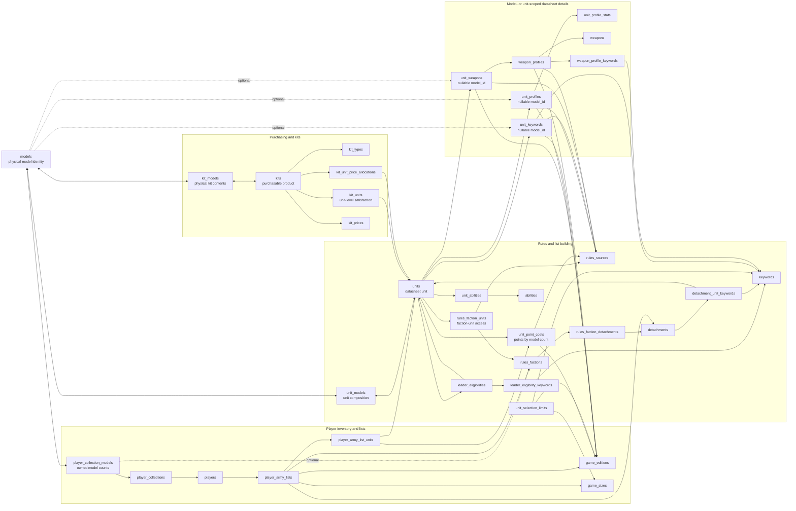

# Model-Centered Data Model

This document describes the logical database shape with `models` at the center.
It focuses on how physical model identities connect list-building rules,
purchasing data, and player collections.

`models` is not the same thing as `units`. A unit is a rules datasheet that can
be selected in an army list. A model is a physical miniature identity that can be
required by a unit, included in a kit, or owned by a player.

## Relationship Diagram

## Core Interpretation

- `unit_models` answers which physical model identities a unit requires or
  permits, and in what counts.
- `kit_models` answers which physical model identities are included in a
  purchasable product.
- `player_collection_models` answers which physical model identities a player
  owns.
- `kit_units` is a unit-level purchasing shortcut. It should remain
  source-backed because it answers whether a kit can satisfy a unit, not merely
  whether it contains similar model names.
- `unit_profiles`, `unit_keywords`, and `unit_weapons` can be model-scoped or
  unit-scoped. Their `model_id` is nullable so a datasheet detail can apply to a
  specific model type or to the unit as a whole.

## Practical Consequence

The target purchase and collection workflow should compare desired army list
units against `unit_models`, owned inventory against `player_collection_models`,
and purchasable products against `kit_models` plus `kit_units`.

That keeps the app aligned with three different user questions:

- Can this faction legally field the unit?
- Which physical models does the player already own?
- Which purchasable kits can close the gap?
